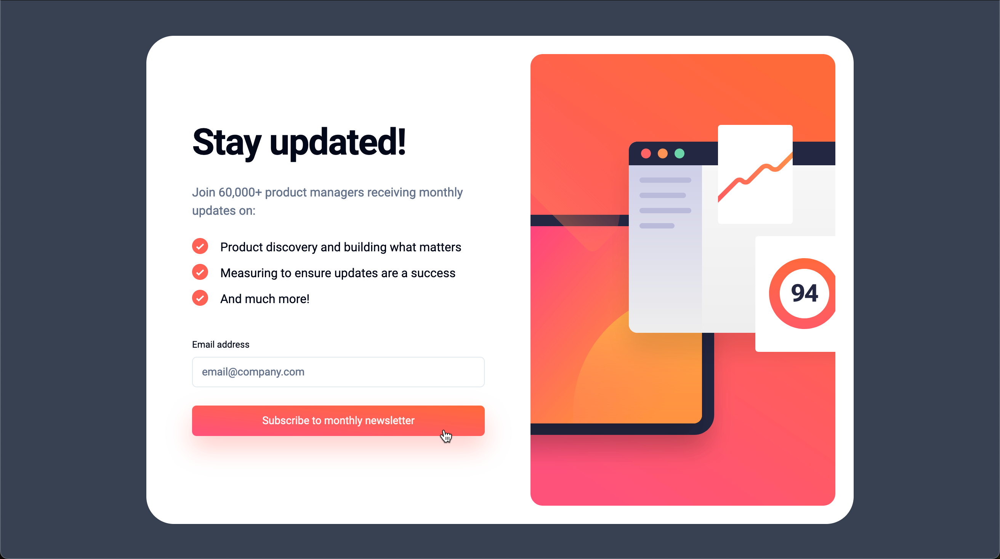

# Frontend Mentor - Newsletter sign-up form with success message solution

This is a solution to the [Newsletter sign-up form with success message challenge on Frontend Mentor](https://www.frontendmentor.io/challenges/newsletter-signup-form-with-success-message-3FC1AZbNrv). Frontend Mentor challenges help you improve your coding skills by building realistic projects.

## Table of contents

- [Overview](#overview)
  - [The challenge](#the-challenge)
  - [Screenshot](#screenshot)
  - [Links](#links)
- [My process](#my-process)
  - [Built with](#built-with)
  - [What I learned](#what-i-learned)
  - [Continued development](#continued-development)
- [Author](#author)

## Overview

### The challenge

Users should be able to:

[x] Add their email and submit the form
[x] See a success message with their email after successfully submitting the form
[x] See form validation messages if:
[x] The field is left empty
[x] The email address is not formatted correctly
[x] View the optimal layout for the interface depending on their device's screen size
[x] See hover and focus states for all interactive elements on the page

### Screenshot

### Links

- Live Site URL: [Live Site](https://newsletter-signup-blush.vercel.app/)

## My process

### Built with

- [React](https://reactjs.org/) - JS library
- [Next.js](https://nextjs.org/) - React framework
- [Tailwind](https://tailwindcss.com/)
- [Zod](https://zod.dev/)
- [React Hook Form](https://react-hook-form.com/)

### What I learned

I have save created components for last before, but this time saving them for last taught me that you can easily over do it with component. Components can definitely help with code organization, but in this case more components just felt like more context switching.

### Continued development

At some point in the future I may come back to add a transition between the sign-up and success states for Framer Motion.

## Author

- Website - [Robert Crocker](https://www.robcrock.com)
- Frontend Mentor - [@robcrock](https://www.frontendmentor.io/profile/robcrock)
- Twitter - [@robcrock](https://twitter.com/robcrock)
- LinkedIn - [@robercrocker](https://www.linkedin.com/in/robertcrocker/)
